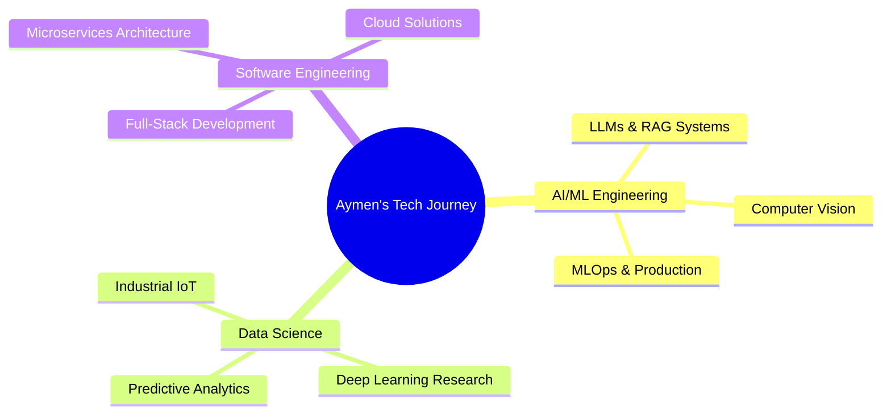

<!-- Header with animated typing effect -->
<div align="center">
  
</div>

<h1 align="center">
  
  Hi there! I'm <a href="https://aymen-portfolio-sage.vercel.app/">Aymen Mabrouk</a> 
  
</h1>

<p align="center">
  <a href="https://git.io/typing-svg">
    
  </a>
</p>

<div align="center">
  
  
  
</div>

<br>

<!-- About Me Section -->


## 🚀 About Me

🎓 **Data Science Engineering Student** at Polytechnique Sousse | **Master's in Software Engineering** at ISIMM  
💼 **5+ years in Tech Industry** | **AI Automation Engineer** at ByteClick Germany  
🔬 **Research-focused** with published papers in tennis analysis using deep learning  
🌟 **Passionate about** transforming ideas into intelligent, scalable solutions  

### 💡 What I Do
- 🤖 **AI/ML Engineering**: Building intelligent systems with TensorFlow, PyTorch, and LangChain
- 📊 **Data Science**: Predictive analytics, computer vision, and deep learning models
- 🌐 **Full-Stack Development**: React, Next.js, Flutter, Node.js, and PostgreSQL
- 🏭 **Industrial IoT**: Smart solutions for manufacturing and automation
- 📈 **MLOps**: End-to-end machine learning pipelines in production

<br clear="right"/>

<!-- Tech Stack -->
## 🛠️ Tech Arsenal

### 🧠 AI/ML & Data Science
<div align="center">
  
  
  
  
  
  
</div>

### 💻 Frontend & Mobile
<div align="center">
  
</div>

### ⚙️ Backend & Database
<div align="center">
  
</div>

### 🔧 DevOps & Tools
<div align="center">
  
</div>

<!-- GitHub Stats -->
## 📊 GitHub Analytics

<div align="center">
  
  
</div>

<div align="center">
  
</div>

<div align="center">
  
</div>

<!-- Featured Projects -->
## 🎯 Featured Projects

<div align="center">

### 🏆 Highlighted Work

[](https://aymen-portfolio-sage.vercel.app/)

</div>

| Project | Description | Tech Stack | Links |
|---------|-------------|------------|-------|
| 🎾 **Padel Court Analysis System** | AI-powered sports analytics with deep learning and computer vision for comprehensive gameplay analysis | Python, TensorFlow, OpenCV, Deep Learning | [🔗 View](https://aymen-portfolio-sage.vercel.app/project/1) |
| 🚗 **Tunisian Parking Management** | Enterprise-grade parking solution with web dashboard and mobile app featuring real-time tracking | Next.js, Flutter, PostgreSQL, NFC, Bluetooth | [🔗 View](https://aymen-portfolio-sage.vercel.app/project/2) |
| 🔍 **Vehicle Entry-Exit System** | Advanced license plate recognition with 98.5% accuracy using microservices architecture | Python, OpenVINO, gRPC, Docker, FastAPI | [🔗 GitHub](https://github.com/AymenMB/Vehicle-Entry-Exit-Registration-System---Microservices-) |
| 🎾 **Tennis Match Analysis** | Deep learning system for ball tracking, bounce detection, and tactical visualization | Python, TensorFlow, CatBoost, Computer Vision | [🔗 View](https://aymen-portfolio-sage.vercel.app/projects/tennis-analysis) |
| 🛍️ **VacayShare Social Platform** | Travel-focused social media app with interactive maps and privacy controls | React, Next.js, MongoDB, Tailwind CSS | [🔗 GitHub](https://github.com/AymenMB/VacayShare) |

<!-- Current Focus -->
## 🎯 Current Focus

<div align="center">



</div>

🔥 **Currently Working On:**
- 🤖 Advanced AI automation pipelines with LangChain
- 📄 Intelligent document processing systems
- 🏭 Industrial IoT solutions for manufacturing optimization
- 📊 MLOps practices for production-ready AI systems

<!-- Experience Timeline -->
## 💼 Professional Journey

```
🚀 2025-Present  │ AI Automation Engineer @ ByteClick Germany
                 │ ▸ LLM-powered automation workflows
                 │ ▸ RAG systems & vector databases
                 │ ▸ SaaS platform development
                 │
🔬 2025 (Jun-Aug) │ Data Science Engineering Intern @ LEONI Tunisia
                 │ ▸ Predictive analytics for production
                 │ ▸ Industrial IoT solutions
                 │ ▸ Machine learning model deployment
                 │
🎓 2024-2026     │ Engineering - Data Science @ Polytechnique Sousse
                 │ ▸ Advanced AI/ML techniques
                 │ ▸ Research & development focus
                 │
🎓 2023-2025     │ Master's - Software Engineering @ ISIMM
                 │ ▸ Full-stack development expertise
                 │ ▸ Agile project management
```

<!-- Achievements -->
## 🏆 Achievements & Recognition

- 📄 **Published Research**: Tennis analysis using deep learning techniques
- 🥇 **Enterprise Solutions**: Built production-ready systems for LEONI Tunisia
- 🚀 **98.5% Accuracy**: Achieved in Tunisian license plate recognition
- 🌟 **5+ Years**: Proven track record in tech industry
- 🏭 **Industrial Impact**: Optimized manufacturing processes through AI

<!-- Connect with Me -->
## 🌐 Let's Connect

<div align="center">

[](https://aymen-portfolio-sage.vercel.app/)
[](https://www.linkedin.com/in/aymen-mabrouk-91102b23b/)
[](https://github.com/AymenMB)
[](mailto:aymen.mabrouk@example.com)

</div>

---

<div align="center">
  
</div>

<div align="center">
  <sub>🚀 Always open to collaborating on innovative projects! Let's build something amazing together.</sub>
</div># Aymen-github-Readme

