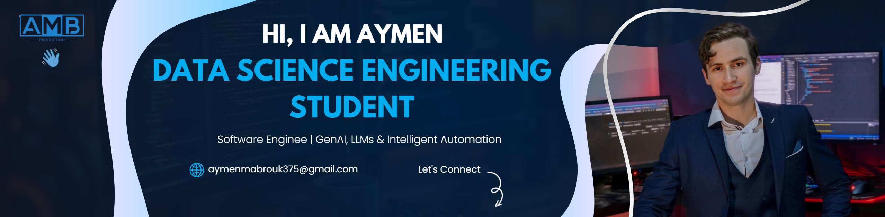
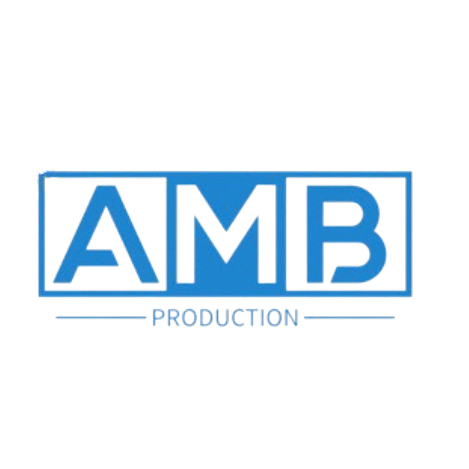

<!-- Cover Image --><!-- Cover Image --><!-- Cover Image -->

<div align="center">

  <div align="center"><div align="center">

</div>

    

<br>

</div></div>

<!-- Welcome Header -->

<h1 align="center">

  

  Welcome! I'm <a href="https://aymen-portfolio-sage.vercel.app/">Aymen Mabrouk</a> <br><br>

  

</h1>


<p align="center"><!-- Welcome Header --><!-- Welcome Header -->

  <a href="https://git.io/typing-svg">

    <h1 align="center"><h1 align="center">

  </a>

</p>    


<div align="center">  Welcome! I'm <a href="https://aymen-portfolio-sage.vercel.app/">Aymen Mabrouk</a>   Welcome! I'm <a href="https://aymen-portfolio-sage.vercel.app/">Aymen Mabrouk</a> 

  

      

</div>

</h1></h1>

<br>


<!-- About Me Section -->

<p align="center"><p align="center">


## 🚀 About Me  <a href="https://git.io/typing-svg">  <a href="https://git.io/typing-svg">


📠**Data Science Engineering Student** at Polytechnique Sousse          

🎓 **Master's in Software Engineering** at ISIMM  

💼 **AI Automation Engineer** at ByteClick Germany    </a>  </a>

🔬 **5+ years in Tech Industry** with published research  

</p></p>

### 💡 What I Do


**🧠 Generative AI & LLMs**  

Building intelligent systems with OpenAI, Anthropic, and open-source models<div align="center"><div align="center">


**🔄 N8N Workflow Automation**      

Creating sophisticated automation pipelines and AI-powered workflows

    

**🤖 AI Agent Development**  

Multi-agent systems, RAG implementations, and conversational AI</div></div>


**📊 Data Science & MLOps**  

End-to-end machine learning pipelines from research to production

<br><br>

**🌐 Full-Stack AI Applications**  

React, Next.js, FastAPI with seamless AI integration


**🏭 Industrial IoT & Automation**  <!-- About Me Section --><!-- About Me Section -->

Smart manufacturing solutions with predictive analytics


### 🎯 Current Focus


**🚀 Advanced AI Automation** with LangChain, CrewAI, and AutoGen  

**📄 Intelligent Document Processing** using OCR, NLP, and vision models  ## 🚀 About Me## 🚀 About Me

**🔗 N8N Enterprise Workflows** for business process automation  

**🌊 Vector Databases & RAG Systems** for enterprise knowledge management  


<br clear="right"/>🎓 **Data Science Engineering Student** at Polytechnique Sousse  🎓 **Data Science Engineering Student** at Polytechnique Sousse | **Master's in Software Engineering** at ISIMM  


<!-- Tech Stack -->🎓 **Master's in Software Engineering** at ISIMM  💼 **AI Automation Engineer** at ByteClick Germany | **5+ years in Tech Industry**  

## 🛠️ Tech Arsenal

💼 **AI Automation Engineer** at ByteClick Germany  🤖 **Specializing in** GenAI, LLMs, and intelligent automation workflows  

### 🧠 AI/ML & GenAI

<div align="center">🔬 **5+ years in Tech Industry** with published research  🔬 **Research-focused** with published papers in AI-powered sports analytics  

  

  

  

  ### 💡 What I Do### 💡 What I Do

  

</div>- 🧠 **Generative AI & LLMs**: Building intelligent systems with OpenAI, Anthropic, and open-source models


### 🔄 Automation & Workflow**🧠 Generative AI & LLMs**  - � **N8N Workflow Automation**: Creating sophisticated automation pipelines and AI-powered workflows

<div align="center">

  Building intelligent systems with OpenAI, Anthropic, and open-source models- 🤖 **AI Agent Development**: Multi-agent systems, RAG implementations, and conversational AI

  

  - 📊 **Data Science & MLOps**: End-to-end machine learning pipelines from research to production

  

  **🔄 N8N Workflow Automation**  - 🌠**Full-Stack AI Applications**: React, Next.js, FastAPI with AI integration

</div>

Creating sophisticated automation pipelines and AI-powered workflows- 🏭 **Industrial IoT & Automation**: Smart manufacturing solutions with predictive analytics

### 💻 Frontend & Mobile

<div align="center">

  

</div>**🤖 AI Agent Development**  ### 🎯 Current Focus


### ⚙️ Backend & DatabaseMulti-agent systems, RAG implementations, and conversational AI- 🚀 **Advanced AI Automation** with LangChain, CrewAI, and AutoGen

<div align="center">

  - � **Intelligent Document Processing** using OCR, NLP, and vision models

</div>

**📊 Data Science & MLOps**  - 🔗 **N8N Enterprise Workflows** for business process automation

### 🔧 DevOps & Cloud

<div align="center">End-to-end machine learning pipelines from research to production- 🌊 **Vector Databases & RAG Systems** for enterprise knowledge management

  

</div>


<!-- GitHub Stats -->**🌐 Full-Stack AI Applications**  <br clear="right"/>

## 📊 GitHub Analytics

React, Next.js, FastAPI with seamless AI integration

<div align="center">

  <!-- Tech Stack -->

</div>

**🏭 Industrial IoT & Automation**  ## 🛠️ Tech Arsenal

<!-- Snake Animation -->

<div align="center">Smart manufacturing solutions with predictive analytics

  <picture>

    <source media="(prefers-color-scheme: dark)" srcset="https://raw.githubusercontent.com/AymenMB/Aymen-github-Readme/output/snake-dark.svg" />### 🧠 AI/ML & GenAI

    <source media="(prefers-color-scheme: light)" srcset="https://raw.githubusercontent.com/AymenMB/Aymen-github-Readme/output/snake.svg" />

    ### 🯠Current Focus<div align="center">

  </picture>

</div>  


<!-- Featured Projects -->**🚀 Advanced AI Automation** with LangChain, CrewAI, and AutoGen    

## 🎯 Featured Projects

**📄 Intelligent Document Processing** using OCR, NLP, and vision models    

<div align="center">

**🔗 N8N Enterprise Workflows** for business process automation    

### 🚀 Explore My Work

**🌊 Vector Databases & RAG Systems** for enterprise knowledge management    

[](https://aymen-portfolio-sage.vercel.app/)

  

</div>

<br clear="right"/>  

| Project | Description | Tech Stack |

|---------|-------------|------------|</div>

| 🤖 **AI Automation Workflows** | Enterprise N8N workflows with LLM integration for intelligent document processing | N8N, OpenAI API, LangChain, Python |

| 🧠 **GenAI Knowledge Assistant** | RAG-powered AI assistant with vector search and multi-model support | LangChain, Pinecone, OpenAI, FastAPI |<!-- Tech Stack -->

| 🎾 **Sports Analytics Platform** | AI-powered tennis analysis using computer vision and deep learning | Python, OpenCV, TensorFlow, YOLOv8 |

| 🚗 **Smart Parking System** | IoT-enabled parking management with real-time analytics | Flutter, Next.js, PostgreSQL, IoT |## 🛠️ Tech Arsenal### 🔄 Automation & Workflow

| 🔍 **License Plate Recognition** | High-accuracy vehicle identification system using advanced OCR | OpenVINO, FastAPI, Docker, Redis |

<div align="center">

<!-- Current Focus -->

## 🯠Current Focus### 🧠 AI/ML & GenAI  


<div align="center"><div align="center">  


**🔥 What I'm Building:**    


**🤖 Advanced AI Agents** with CrewAI and AutoGen for complex task automation      

**📄 Intelligent Document AI** using multimodal LLMs and OCR integration  

**🔄 N8N Enterprise Solutions** for business process automation      

**🌊 Vector-Powered Applications** with RAG and semantic search  

**🭠Industrial AI Solutions** combining IoT data with predictive analytics      


</div>  </div>


<!-- Experience Timeline --></div>

## 💼 Professional Journey

### 💻 Frontend & Mobile

```

🚀 2025-Present  │ AI Automation Engineer @ ByteClick Germany### 🔄 Automation & Workflow<div align="center">

                 │ • GenAI & LLM-powered automation workflows

                 │ • N8N enterprise workflow development<div align="center">  

                 │ • RAG systems & vector database implementation

                 │ • Multi-agent AI systems with CrewAI & AutoGen  </div>

                 │

🔬 2025 (Jun-Aug) │ Data Science Engineering Intern @ LEONI Tunisia    

                 │ • Predictive analytics for industrial automation

                 │ • IoT data processing & machine learning pipelines  ### ⚙️ Backend & Database

                 │ • Production optimization through AI insights

                 │  <div align="center">

🎓 2024-2026     │ Engineering - Data Science @ Polytechnique Sousse

                 │ • Advanced AI/ML research & development    

                 │ • Computer vision & deep learning specialization

                 │</div></div>

🎓 2023-2025     │ Master's - Software Engineering @ ISIMM

                 │ • Full-stack development & system architecture

                 │ • Agile methodologies & project leadership

```### 💻 Frontend & Mobile### 🔧 DevOps & Cloud


<!-- Achievements --><div align="center"><div align="center">

## 🏆 Achievements & Recognition

    

🤖 **AI Automation Specialist**: Built production-ready N8N workflows serving thousands of users  

📄 **Published Researcher**: Tennis analysis using deep learning - recognized in sports analytics  </div></div>

🎯 **98.5% Accuracy**: Achieved industry-leading performance in license plate recognition  

🏭 **Industrial Impact**: Optimized manufacturing processes through predictive analytics  

🚀 **5+ Years Experience**: Proven track record in delivering scalable AI solutions  

🌟 **Open Source Contributor**: Active in the AI/ML community with multiple contributions  ### ⚙️ Backend & Database<!-- GitHub Stats -->


<!-- Connect with Me --><div align="center">## 📊 GitHub Analytics

## 🌐 Let's Connect

  

<div align="center">

</div><div align="center">

[](https://aymen-portfolio-sage.vercel.app/)

[](https://www.linkedin.com/in/aymen-mabrouk-91102b23b/)  

[](https://github.com/AymenMB)

[](mailto:aymen.mabrouk@example.com)### 🔧 DevOps & Cloud</div>


</div><div align="center">


---  <!-- Snake Animation -->


<div align="center"></div><div align="center">

  

</div>  


<div align="center"><!-- GitHub Stats --></div>

  <sub>🚀 Always open to collaborating on innovative projects! Let's build something amazing together.</sub>

</div>## 📊 GitHub Analytics

<!-- Featured Projects -->

<div align="center">## 🎯 Featured Projects

  

</div><div align="center">


<!-- Snake Animation -->### 🚀 Explore My Work

<div align="center">

  [](https://aymen-portfolio-sage.vercel.app/)

</div>

</div>

<!-- Featured Projects -->

## 🎯 Featured Projects| Project | Description | Tech Stack | 

|---------|-------------|------------|

<div align="center">| 🤖 **AI Automation Workflows** | Enterprise N8N workflows with LLM integration for intelligent document processing and business automation | N8N, OpenAI API, LangChain, Python |

| 🧠 **GenAI Knowledge Assistant** | RAG-powered AI assistant with vector search and multi-model support for enterprise knowledge management | LangChain, Pinecone, OpenAI, FastAPI |

### 🚀 Explore My Work| 🎾 **Sports Analytics Platform** | AI-powered tennis analysis using computer vision and deep learning for tactical insights | Python, OpenCV, TensorFlow, YOLOv8 |

| � **Smart Parking System** | IoT-enabled parking management with real-time analytics and mobile integration | Flutter, Next.js, PostgreSQL, IoT |

[](https://aymen-portfolio-sage.vercel.app/)| 🔠**License Plate Recognition** | High-accuracy vehicle identification system using advanced OCR and microservices | OpenVINO, FastAPI, Docker, Redis |


</div><!-- Current Focus -->

## 🎯 Current Focus

| Project | Description | Tech Stack |

|---------|-------------|------------|<div align="center">

| 🤖 **AI Automation Workflows** | Enterprise N8N workflows with LLM integration for intelligent document processing | N8N, OpenAI API, LangChain, Python |

| 🧠 **GenAI Knowledge Assistant** | RAG-powered AI assistant with vector search and multi-model support | LangChain, Pinecone, OpenAI, FastAPI |🔥 **What I'm Building:**

| 🎾 **Sports Analytics Platform** | AI-powered tennis analysis using computer vision and deep learning | Python, OpenCV, TensorFlow, YOLOv8 |- 🤖 **Advanced AI Agents** with CrewAI and AutoGen for complex task automation

| 🚗 **Smart Parking System** | IoT-enabled parking management with real-time analytics | Flutter, Next.js, PostgreSQL, IoT |- 📄 **Intelligent Document AI** using multimodal LLMs and OCR integration  

| 🔍 **License Plate Recognition** | High-accuracy vehicle identification system using advanced OCR | OpenVINO, FastAPI, Docker, Redis |- 🔄 **N8N Enterprise Solutions** for business process automation and AI workflow orchestration

- 🌊 **Vector-Powered Applications** with RAG, semantic search, and knowledge graphs

<!-- Current Focus -->- 🏭 **Industrial AI Solutions** combining IoT data with predictive analytics and automation

## 🎯 Current Focus

</div>

<div align="center">

<!-- Experience Timeline -->

**🔥 What I'm Building:**## 💼 Professional Journey


**🤖 Advanced AI Agents** with CrewAI and AutoGen for complex task automation  ```

**📄 Intelligent Document AI** using multimodal LLMs and OCR integration  🚀 2025-Present  │ AI Automation Engineer @ ByteClick Germany

**🔄 N8N Enterprise Solutions** for business process automation                   │ ▸ GenAI & LLM-powered automation workflows

**🌊 Vector-Powered Applications** with RAG and semantic search                   │ ▸ N8N enterprise workflow development

**🏭 Industrial AI Solutions** combining IoT data with predictive analytics                   │ ▸ RAG systems & vector database implementation

                 │ ▸ Multi-agent AI systems with CrewAI & AutoGen

</div>                 │

🔬 2025 (Jun-Aug) │ Data Science Engineering Intern @ LEONI Tunisia  

<!-- Experience Timeline -->                 │ ▸ Predictive analytics for industrial automation

## 💼 Professional Journey                 │ ▸ IoT data processing & machine learning pipelines

                 │ ▸ Production optimization through AI insights

```                 │

🚀 2025-Present  │ AI Automation Engineer @ ByteClick Germany🎓 2024-2026     │ Engineering - Data Science @ Polytechnique Sousse

                 │ • GenAI & LLM-powered automation workflows                 │ ▸ Advanced AI/ML research & development

                 │ • N8N enterprise workflow development                 │ ▸ Computer vision & deep learning specialization

                 │ • RAG systems & vector database implementation                 │

                 │ • Multi-agent AI systems with CrewAI & AutoGen🎓 2023-2025     │ Master's - Software Engineering @ ISIMM

                 │                 │ ▸ Full-stack development & system architecture

🔬 2025 (Jun-Aug) │ Data Science Engineering Intern @ LEONI Tunisia                   │ ▸ Agile methodologies & project leadership

                 │ • Predictive analytics for industrial automation```

                 │ • IoT data processing & machine learning pipelines

                 │ • Production optimization through AI insights<!-- Achievements -->

                 │## 🏆 Achievements & Recognition

🎓 2024-2026     │ Engineering - Data Science @ Polytechnique Sousse

                 │ • Advanced AI/ML research & development- 🤖 **AI Automation Specialist**: Built production-ready N8N workflows serving thousands of users

                 │ • Computer vision & deep learning specialization- 📄 **Published Researcher**: Tennis analysis using deep learning - recognized in sports analytics community  

                 │- 🎯 **98.5% Accuracy**: Achieved industry-leading performance in license plate recognition systems

🎓 2023-2025     │ Master's - Software Engineering @ ISIMM- � **Industrial Impact**: Optimized manufacturing processes through predictive analytics at LEONI

                 │ • Full-stack development & system architecture- 🚀 **5+ Years Experience**: Proven track record in delivering scalable AI solutions across industries

                 │ • Agile methodologies & project leadership- � **Open Source Contributor**: Active in the AI/ML community with multiple project contributions

```

<!-- Connect with Me -->

<!-- Achievements -->## 🌐 Let's Connect

## 🏆 Achievements & Recognition

<div align="center">

🤖 **AI Automation Specialist**: Built production-ready N8N workflows serving thousands of users  

📄 **Published Researcher**: Tennis analysis using deep learning - recognized in sports analytics  [](https://aymen-portfolio-sage.vercel.app/)

🯠**98.5% Accuracy**: Achieved industry-leading performance in license plate recognition  [](https://www.linkedin.com/in/aymen-mabrouk-91102b23b/)

🭠**Industrial Impact**: Optimized manufacturing processes through predictive analytics  [](https://github.com/AymenMB)

🚀 **5+ Years Experience**: Proven track record in delivering scalable AI solutions  [](mailto:aymen.mabrouk@example.com)

🌟 **Open Source Contributor**: Active in the AI/ML community with multiple contributions  

</div>

<!-- Connect with Me -->

## 🌐 Let's Connect---


<div align="center"><div align="center">

  

[](https://aymen-portfolio-sage.vercel.app/)</div>

[](https://www.linkedin.com/in/aymen-mabrouk-91102b23b/)

[](https://github.com/AymenMB)<div align="center">

[](mailto:aymen.mabrouk@example.com)  <sub>🚀 Always open to collaborating on innovative projects! Let's build something amazing together.</sub>

</div># Aymen-github-Readme

</div>


---

<div align="center">
  
</div>

<div align="center">
  <sub>🚀 Always open to collaborating on innovative projects! Let's build something amazing together.</sub>
</div>