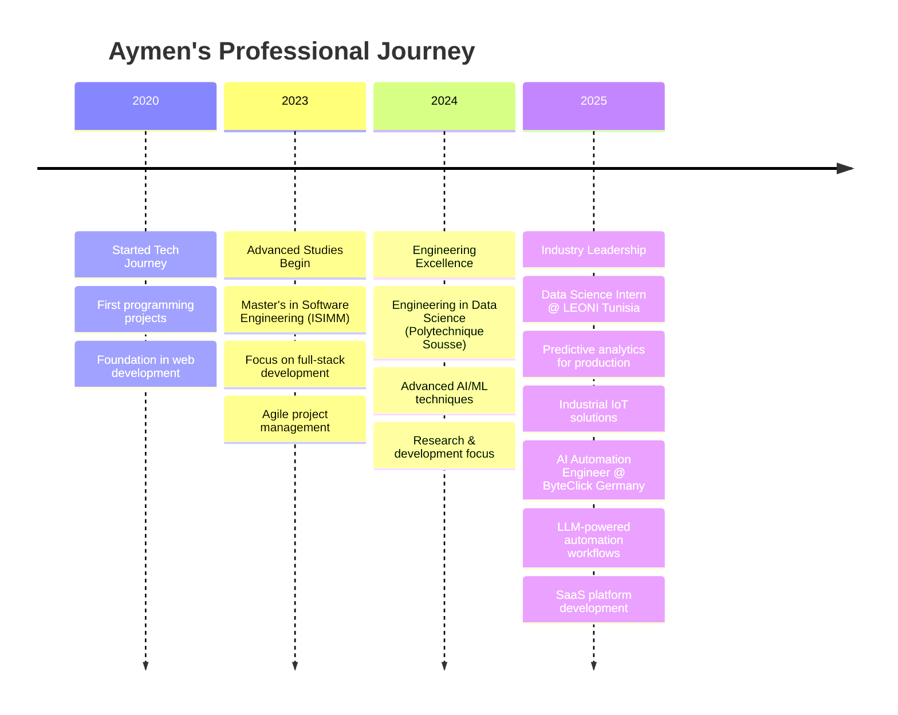

<!-- Enhanced GitHub Profile with Advanced Animations and Interactive Elements -->
<div align="center">
  <!-- Dynamic Header with Gradient Background -->
  
</div>

<!-- Profile Banner -->
<div align="center">
  
</div>

<!-- Animated Name and Title -->
<h1 align="center">
  
  <br>
  <span style="background: linear-gradient(45deg, #00A3FF, #00FFF0, #8E74FE); -webkit-background-clip: text; -webkit-text-fill-color: transparent; font-size: 3em; font-weight: bold;">
    Aymen Mabrouk
  </span>
  
</h1>

<!-- Typing Animation with Enhanced Styling -->
<p align="center">
  
</p>

<!-- Enhanced Stats Badges -->
<div align="center">
  
  
  
  
  
</div>

<br>

<!-- About Me with Enhanced Layout -->
<table align="center">
<tr>
<td width="50%" valign="top">

## 🚀 About Me

```typescript
class AymenMabrouk implements DataScientist, SoftwareEngineer {
  name: string = "Aymen Mabrouk";
  location: string = "Tunisia 🇹🇳";
  education: string[] = [
    "Data Science Engineering @ Polytechnique Sousse",
    "Master's Software Engineering @ ISIMM"
  ];
  
  currentRole: string = "AI Automation Engineer @ ByteClick Germany";
  experience: string = "5+ years in Tech Industry";
  
  passions: string[] = [
    "🤖 AI/ML Engineering",
    "📊 Data Science Research", 
    "🌐 Full-Stack Development",
    "🏭 Industrial IoT Solutions",
    "✨ Innovation & Automation"
  ];
  
  currentFocus(): string[] {
    return [
      "🧠 LLM-powered automation workflows",
      "📄 Intelligent document processing",
      "🔬 Computer vision research",
      "🚀 MLOps & production AI systems"
    ];
  }
  
  lifePhilosophy(): string {
    return "Transforming complex problems into elegant solutions! 💡";
  }
}
```

</td>
<td width="50%" valign="top">

## 📈 GitHub Insights


</td>
</tr>
</table>

<!-- Enhanced Tech Stack with Categories -->
## 🛠️ Technology Arsenal

<details open>
<summary><b>🧠 AI/ML & Data Science Stack</b></summary>
<br>
<div align="center">
  
  
  
  
  
  
  
  
  
</div>
</details>

<details>
<summary><b>💻 Frontend & Mobile Development</b></summary>
<br>
<div align="center">
  
  
  
  
  
  
  
  
</div>
</details>

<details>
<summary><b>⚙️ Backend & Database Technologies</b></summary>
<br>
<div align="center">
  
  
  
  
  
  
  
</div>
</details>

<details>
<summary><b>🔧 DevOps & Cloud Infrastructure</b></summary>
<br>
<div align="center">
  
  
  
  
  
  
  
</div>
</details>

<!-- Advanced GitHub Analytics -->
## 📊 Advanced GitHub Analytics

<div align="center">
  


</div>

<div align="center">
  
</div>

<!-- Enhanced Featured Projects -->
## 🎯 Flagship Projects

<div align="center">

### 🌟 **[Visit My Complete Portfolio](https://aymen-portfolio-sage.vercel.app/)** 🌟

</div>

<table align="center">
<tr>
<td width="50%" valign="top">

### 🎾 [Padel Court Analysis System](https://aymen-portfolio-sage.vercel.app/project/1)
**AI-powered sports analytics with deep learning**

🔥 **Highlights:**
- Multi-angle court keypoint detection
- Enhanced ball tracking with TrackNet
- 4-player simultaneous detection
- Real-time GPU-accelerated processing

**Tech Stack:**


</td>
<td width="50%" valign="top">

### 🚗 [Parking Management System](https://aymen-portfolio-sage.vercel.app/project/2)
**Enterprise-grade solution for LEONI Tunisia**

🔥 **Highlights:**
- Cross-platform Flutter mobile app
- Real-time attendance tracking
- NFC/Bluetooth integration
- Microservices architecture

**Tech Stack:**


</td>
</tr>
<tr>
<td width="50%" valign="top">

### 🔍 [Vehicle Recognition System](https://github.com/AymenMB/Vehicle-Entry-Exit-Registration-System---Microservices-)
**98.5% accuracy license plate recognition**

🔥 **Highlights:**
- Tunisian ID card OCR extraction
- gRPC microservices architecture
- Docker containerization
- Real-time video processing

**Tech Stack:**


</td>
<td width="50%" valign="top">

### 🎾 [Tennis Analysis Research](https://aymen-portfolio-sage.vercel.app/projects/tennis-analysis)
**Published research on sports analytics**

🔥 **Highlights:**
- Ball tracking and bounce detection
- Tactical visualization system
- Research paper published
- Coach-friendly analytics

**Tech Stack:**


</td>
</tr>
</table>

<!-- Professional Journey Timeline -->
## 💼 Professional Evolution



<!-- Current Focus and Goals -->
## 🎯 Current Mission & Vision

<div align="center">

### 🚀 **Transforming Ideas into Intelligent Solutions**

</div>

<table align="center">
<tr>
<td width="33%" align="center">

### 🤖 **AI Innovation**
Building next-generation AI systems that solve real-world problems with cutting-edge technology

</td>
<td width="33%" align="center">

### 📊 **Data-Driven Impact**
Leveraging data science to create predictive models and intelligent automation solutions

</td>
<td width="33%" align="center">

### 🌐 **Full-Stack Excellence**
Developing comprehensive solutions from frontend to backend with modern technologies

</td>
</tr>
</table>

### 🔥 Currently Working On:
- 🧠 Advanced LLM integration for business automation
- 📄 Intelligent document processing with RAG systems
- 🏭 Industrial IoT solutions for manufacturing optimization
- 🔬 Computer vision research for sports analytics
- 🚀 MLOps practices for production AI deployments

<!-- Achievements and Recognition -->
## 🏆 Achievements & Impact

<div align="center">

| 🎯 **Achievement** | 📊 **Impact** | 🔗 **Evidence** |
|-------------------|---------------|-----------------|
| **Research Publication** | Tennis analysis using deep learning | [📄 Research Paper](https://aymen-portfolio-sage.vercel.app/projects/tennis-analysis) |
| **98.5% Accuracy** | License plate recognition system | [🔍 Live Demo](https://github.com/AymenMB/Vehicle-Entry-Exit-Registration-System---Microservices-) |
| **Enterprise Solutions** | Production systems for LEONI Tunisia | [🏭 Case Study](https://aymen-portfolio-sage.vercel.app/project/2) |
| **5+ Years Experience** | Proven track record in tech industry | [💼 Portfolio](https://aymen-portfolio-sage.vercel.app/) |
| **AI Automation** | 70% reduction in manual workload | [🤖 ByteClick Projects](https://aymen-portfolio-sage.vercel.app/) |

</div>

<!-- Enhanced Connect Section -->
## 🌐 Let's Build Something Amazing Together!

<div align="center">

### 💫 **Ready to collaborate on your next big idea?**

<table align="center">
<tr>
<td align="center">

[](https://aymen-portfolio-sage.vercel.app/)

**Complete project showcase**
*Interactive demos & case studies*

</td>
<td align="center">

[](https://www.linkedin.com/in/aymen-mabrouk-91102b23b/)

**Professional networking**
*Industry insights & collaboration*

</td>
</tr>
<tr>
<td align="center">

[](https://github.com/AymenMB)

**Open source contributions**
*Code repositories & projects*

</td>
<td align="center">

[](mailto:aymen.mabrouk@contact.com)

**Direct communication**
*Project discussions & opportunities*

</td>
</tr>
</table>

</div>

<!-- Fun Facts Section -->
## 🎉 Fun Facts & Interests

<div align="center">

🎾 **Sports Analytics Enthusiast** | 🤖 **AI Automation Advocate** | 🌍 **Tech Innovation Explorer**

*"Every complex problem is just an elegant solution waiting to be discovered!"* ✨

</div>

<!-- Activity Section -->
## 📈 Recent Activity

<!--START_SECTION:activity-->
<!--END_SECTION:activity-->

<!-- Footer with Animation -->
<div align="center">
  
</div>

<div align="center">
  <sub>🚀 Always excited about new opportunities and collaborations! Let's turn your ideas into reality.</sub>
  <br><br>
   
  <em><b>I love connecting with different people</b> so if you want to say <b>hi, I'll be happy to meet you more!</b> 😊</em>
</div>